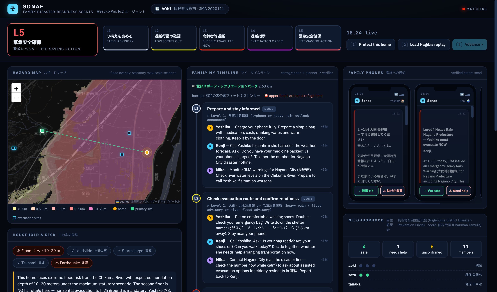
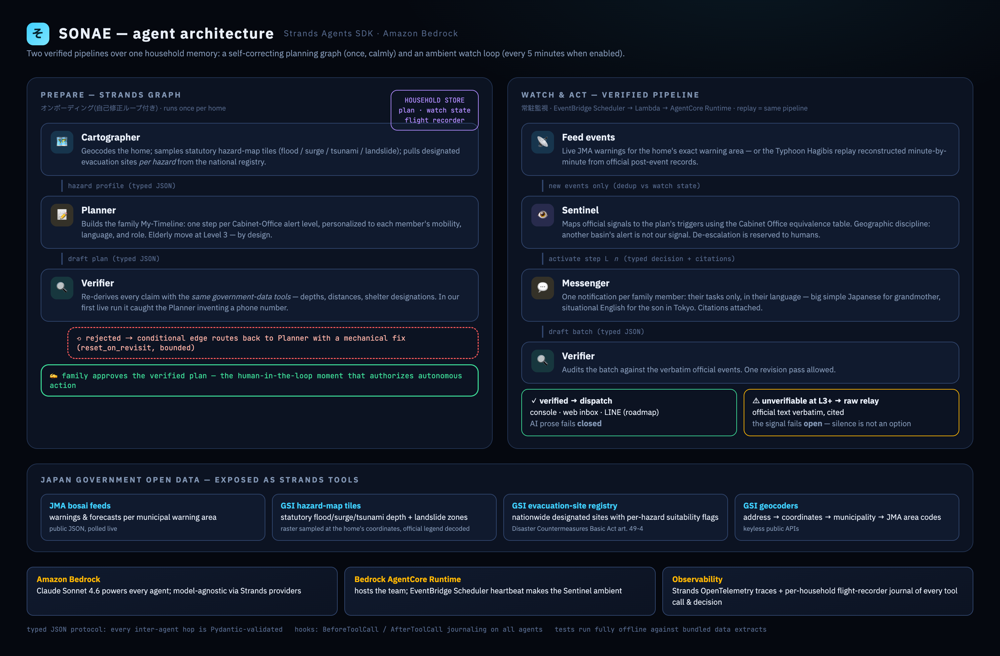
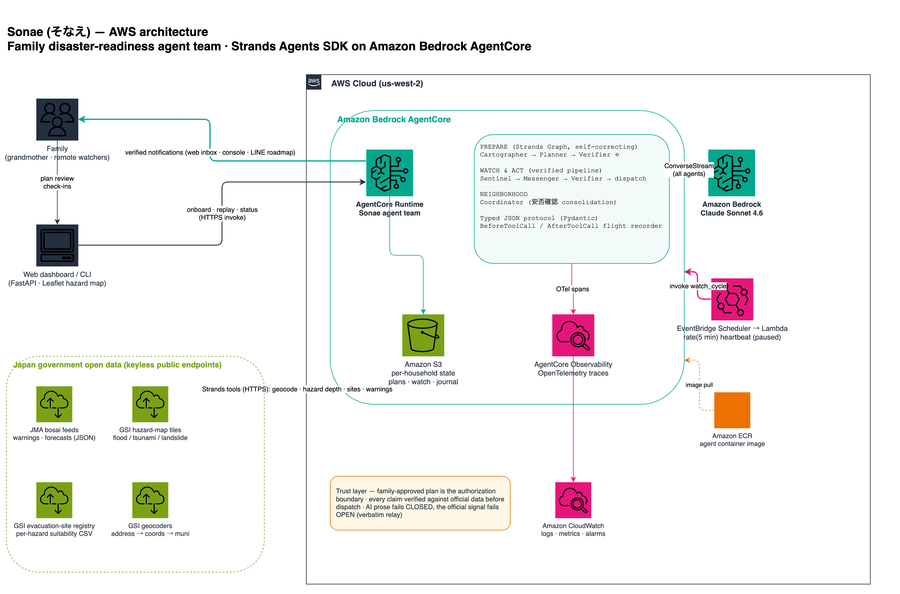
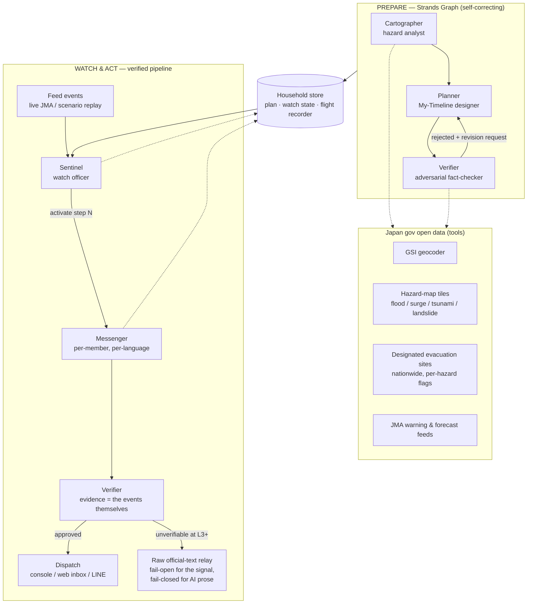

# Sonae (そなえ) — the agent team that stands watch over your family

> Japan tells every family to prepare a personal evacuation timeline. Almost no one does — it's hours of
> hazard-map reading, shelter research, and family coordination. **Sonae is a team of Strands agents that
> does that work in minutes, then stays on watch over official government feeds, and — when the water
> rises — runs your family's plan, person by person, in each person's language.**

Built for the **AWS Agents for Humans Hackathon** (Good Neighbor track) with the
[Strands Agents SDK](https://strandsagents.com/) and Japan's government open data.

**Demo video:** _(link)_ · **Live demo:** _(link)_


*Mid-replay, all content agent-generated: the home (amber) sits in the Chikuma River's 10–20 m
statutory inundation zone; the plan's steps light up as official signals fire; each family member's
phone receives their verified, cited instructions — Japanese for grandmother, English for her son in
Tokyo — with safety check-in buttons, and the neighborhood association board on the right.*

---

## The problem

- Japan's Cabinet Office urges every household to prepare a **My-Timeline (マイ・タイムライン)** — a
  pre-agreed plan of who does what at each official alert level. Making one means reading statutory
  hazard maps, finding which designated evacuation site covers *which* hazard, and negotiating with your
  family. It is homework assigned to 125 million people, and almost nobody has done it.
- **About 80% of flood fatalities in Japan are people aged 65+.** The hardest case is the one millions of
  adult children live with: an aging parent alone in the family home, hours away.
- The night of Typhoon Hagibis (October 12, 2019), Nagano City issued its evacuation order for the
  Chikuma riverside at **23:40 — in darkness and driving rain**. The river had been on flood *warning*
  footing since **17:30**, while it was still light. People with time to leave didn't know their window
  was closing. The levee at Hoyasu failed before dawn; the Naganuma district flooded to roof height.
  (Chronology: [Nagano City post-event verification report](https://www.city.nagano.nagano.jp/documents/1803/346440.pdf), pp. 24–28.)

Alert apps broadcast the same warning to everyone. **What families lack is not information — it's
execution:** a plan made calmly in advance, personalized to grandma's knees, and someone who never
sleeps binding tonight's official signals to that plan.

## What Sonae does

| Phase | What happens | Agents |
|---|---|---|
| **Prepare** (5 min) | Give it an address and your family's reality ("mother, 78, bad knees, no car"). It reads the statutory hazard maps at that exact point, picks designated evacuation sites *per hazard*, and drafts the family My-Timeline — then an adversarial verifier re-derives every claim from official data before you see it. | Cartographer → Planner → Verifier |
| **Watch** (always) | It monitors JMA warning feeds for that household's exact warning area. Nothing happening is the normal, boring case — that's the job. | Sentinel |
| **Act** (the bad night) | When official signals cross the plan's triggers, it activates the right step — not the whole plan — and messages each family member *their* tasks, in *their* language, with citations to the official source. Elderly-first at Level 3, exactly what Level 3 exists for. | Sentinel → Messenger → Verifier |
| **Recover** | Safety check-ins fan out and consolidate; post-disaster paperwork guidance (罹災証明書, support programs) follows. | Navigator |

## Why this is an agent, not an app

Yahoo! Bosai and NERV broadcast alerts — one message, everyone, no memory. Sonae:

- **holds state**: your family, your plan, what level is already activated, what was already sent;
- **makes scoped decisions**: "does *this* bulletin, for *this* river, activate *this* step?" — and stands by
  through dozens of irrelevant signals without crying wolf;
- **acts**: composes and dispatches per-person instructions, in Japanese for grandma, English for her son abroad;
- **audits itself**: every claim is checked against official sources before it ships, and every tool call is
  journaled to a per-household flight recorder — the same discipline Japan's post-event verification
  reports apply to municipal decisions, applied to the agents.

## Architecture



**AWS deployment view** ([editable draw.io source](docs/architecture-aws.drawio)):



<details>
<summary>Same architecture as mermaid (text)</summary>



</details>

**Strands features used:** multi-agent `Graph` with a conditional revision edge (the verification loop),
tool use over government open data, hook providers (`BeforeToolCall`/`AfterToolCall` flight recorder),
Pydantic-validated JSON inter-agent protocol, model-agnostic providers (Bedrock default, Anthropic API
fallback). Deployment on Amazon Bedrock AgentCore: see [`deploy/agentcore/`](deploy/agentcore/).

## The trust layer

An agent that tells your mother when to leave her home must not hallucinate. Sonae's answer is layered:

1. **No invented judgments.** Sonae never decides *whether* evacuation is warranted. Officials do. Sonae
   binds a **family-approved** plan to official signals; the approval (human-in-the-loop) happens calmly,
   in advance, not at 2 a.m.
2. **Independent re-verification.** The onboarding Verifier holds the same government-data tools and
   re-derives depths, distances, and shelter designations itself before approving the plan. In the watch
   pipeline, drafts are audited against the verbatim official events.
3. **Citations everywhere.** Every user-facing claim carries its official source.
4. **Asymmetric failure.** AI prose fails **closed** (unverified text is never sent). The signal fails
   **open**: if composition can't be verified during a Level 3+ event, Sonae relays the official text
   verbatim rather than staying silent.
5. **Flight recorder.** Every tool call and decision is journaled per household and replayable.

## Government open data used

| Source | What Sonae reads | Access |
|---|---|---|
| [JMA warning/forecast feeds](https://www.jma.go.jp/bosai/) | Live warnings & advisories per municipal warning area | public JSON |
| [GSI hazard-map portal](https://disaportal.gsi.go.jp/) | Statutory flood / storm-surge / tsunami depths, landslide zones at the home's coordinates | open raster tiles (legend-decoded) |
| [GSI evacuation-site data](https://hinanmap.gsi.go.jp/) | All designated emergency evacuation sites nationwide with per-hazard suitability (Disaster Countermeasures Basic Act art. 49-4) | open CSV |
| [GSI geocoders](https://msearch.gsi.go.jp/) | Address → coordinates → municipality | public API |
| [Nagano City verification report](https://www.city.nagano.nagano.jp/documents/1803/346440.pdf) et al. | Minute-accurate official chronology for the Typhoon Hagibis replay | public PDF |

Data caveats required by the providers (e.g. "shelter data may lag municipal updates") are carried
through the pipeline and shown to users — relaying caveats is part of relaying data.

## Quickstart

```bash
git clone <this repo> && cd sonae
uv sync

# Model provider (pick one)
export AWS_PROFILE=your-profile AWS_REGION=us-west-2   # Amazon Bedrock (default)
# or: export SONAE_MODEL_PROVIDER=anthropic ANTHROPIC_API_KEY=sk-ant-...

# 1. Onboard the demo family (grandmother by the Chikuma River, son in Tokyo)
uv run sonae onboard examples/aoki_family.json --approve

# 2. Replay the night of Typhoon Hagibis against the plan (official chronology)
uv run sonae replay aoki scenarios/hagibis_2019_nagano.json --pause

# 3. Or watch live JMA feeds for the household's real warning area
uv run sonae watch aoki --interval 300

# Web dashboard (what the demo video shows)
uv run uvicorn sonae.web.app:app --port 8000   # → http://localhost:8000
```

Tests run fully offline against bundled data extracts: `uv run pytest`.

## The 2019 counterfactual

Run the replay and watch the timestamps. The official evacuation order came at **23:40**. Sonae's plan —
generated from the same hazard maps anyone could have read — starts Yoshiko's evacuation at the
**17:30 flood-warning bulletin (Level 3 equivalent), while it was still daylight**, and has her son
calling her at 15:30 when the emergency warning is issued. Six hours of margin, reconstructed
minute-by-minute from the official record. That margin is the product.

## Responsible AI

See [docs/responsible-ai.md](docs/responsible-ai.md): scope limits (organize & relay official
information, never predict or advise beyond it), the verification gate, failure-mode analysis, and why
family approval is the authorization boundary. Sonae is a preparedness aid, not a replacement for
official warnings — municipal instructions always take precedence.

## License

[MIT](LICENSE). Built with respect for the people of the Chikuma River valley, and for every family
whose group chat lights up when the rain starts.
